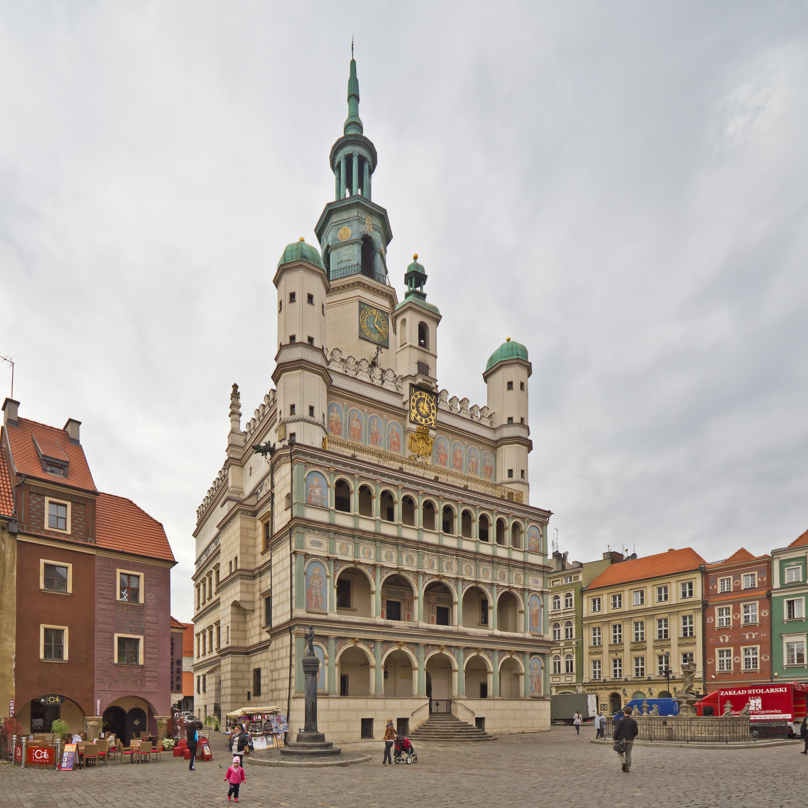
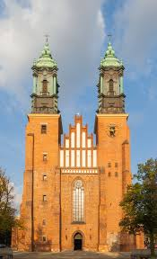
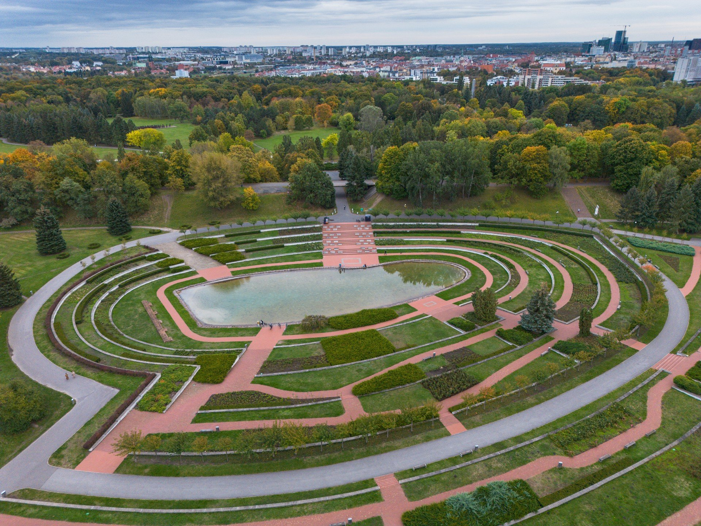

# Najważniejsze Atrakcje Poznania

### 1. Stary Rynek i Ratusz
Sercem miasta jest Stary Rynek z renesansowym Ratuszem.

---

### 2. Ostrów Tumski i Katedra
To najstarsza część miasta.

---

### 3. Park Cytadela
Poznański Central Park.

## Pozostałe ciekawe miejsca:
* **Jezioro Maltańskie** – tor regatowy i tereny rekreacyjne.
* **Stary Browar** – centrum handlu i sztuki.
* **Palmiarnia Poznańska** – jedna z największych w Europie.

[Wróć do strony głównej]({{ site.baseurl }}/)
